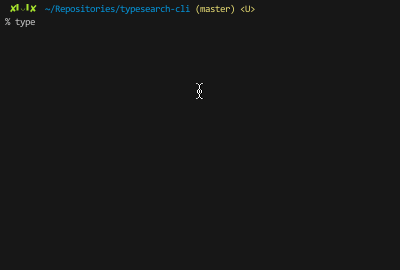

typesearch-cli
===

Command line tool that to search Type Definition from DefinitelyTyped.

[](https://www.npmjs.com/packages/typesearch-cli)
[](https://github.com/isoden/typesearch-cli)

## Installation

```console
$ npm install typesearch-cli --global
```

## Usage

### Basic



### Install selected package


## Related

- :star2: [polm/searchy](https://github.com/polm/searchy) 

## License

[MIT License](https://github.com/isoden/typesearch-cli/blob/master/LICENSE)
